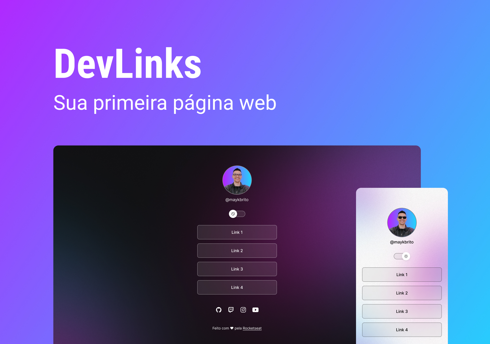

<h1 align="center"> DevLinks </h1>

Programa gratuito promovido pela Rocketseat para ensino de tecnologias WEB.

  <a href="#-tecnologias">Tecnologias</a>&nbsp;&nbsp;&nbsp;|&nbsp;&nbsp;&nbsp;
  <a href="#-projeto">Projeto</a>&nbsp;&nbsp;&nbsp;|&nbsp;&nbsp;&nbsp;
  <a href="#-layout">Layout</a>&nbsp;&nbsp;&nbsp;|&nbsp;&nbsp;&nbsp;
  <a href="#memo-licença">Licença</a>&nbsp;&nbsp;&nbsp;|&nbsp;&nbsp;&nbsp;
  <a href="#aprendizado">Aprendizado</a>

  

 

  

## 🚀 Tecnologias

Esse projeto foi desenvolvido com as seguintes tecnologias:

- HTML e CSS
- JavaScript
- Git e Github
- Figma

## 💻 Projeto

O DevLinks é um projeto que cria um LinkTree, uma página agregadora de links que pode ser adicionada na bio do Instagram, por exemplo, que é onde é mais comumente vista. 

## 🔖 Layout

Você pode visualizar o layout do projeto através [DESSE LINK](https://www.figma.com/file/FTTiDKY6icqvvQOgyOSqFG/DevLinks-(Community)?node-id=0%3A1&t=7aDV43xDTLFfe1Xb-0). É necessário ter conta no [Figma](https://figma.com) para acessá-lo.

## :memo: Licença

Esse projeto está sob a licença MIT.

## 📝 Aprendizado
Ao realizar esse projeto, pude ter grandes aprendizados sobre centralização de elementos com o CSS em diferentes situações, como um elemento em posição absoluta, com display block, flex ou um texto. Além disso, apliquei o JS e pude compreender melhor o conceito de programação orientada à objetos. Também aprendi a utilizar o git, subindo este projeto para o github através do git bash. 

---

Feito com ♥ by Rocketseat :wave: [Participe da nossa comunidade!](https://discord.gg/rocketseat)